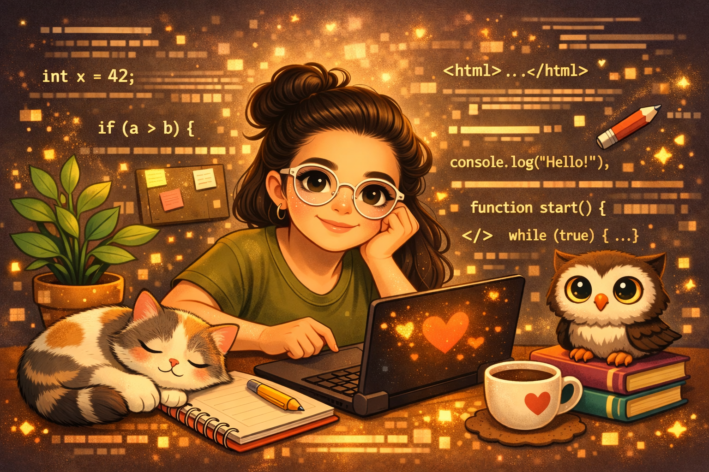

  

# 👩‍💻 Valentina Carrillo Ramírez

I am a **Systems Technician (2012)** and currently a **Software Analysis and Development student**.

I am passionate about programming and eager to participate in projects that allow me to apply and improve my technical skills while growing professionally in the IT field.

## 🎯 Goals

* Learn and apply programming languages in real-world projects.
* Develop practical skills in software analysis and development.
* Continue learning and growing in the technology field.

## 💻 Knowledge

* Hardware and computer systems fundamentals.
* Basic use of digital tools (Canva, Trello).
* Python (beginner level).
* SQL databases (currently preparing to learn).

## 🛠️ Tools & Methodologies

* Git & GitHub (repositories and version control).
* Agile methodologies (SCRUM - learning).
* Project documentation and organization.

## 🌱 Interests

* Programming and software development.
* Continuous learning in IT.
* Creativity and personal projects.

